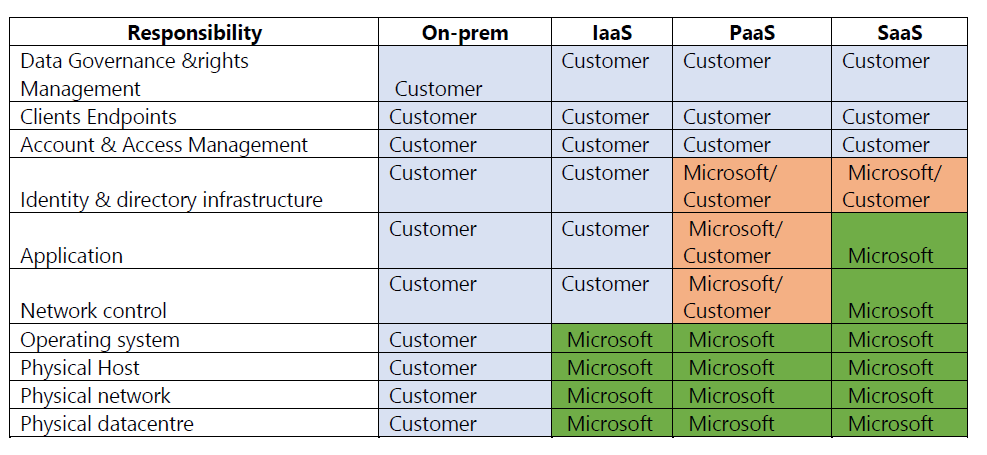

**What is Azure?**

Microsoft Azure is an ever-expanding set of cloud services to help your organization meet your business challenges. It’s the freedom to build, manage, and deploy applications on a massive, global network using your favorite tools and frameworks.
Azure is Microsoft's cloud solution. A cloud is essentially a collection of host data centers that you don't have to directly manage. You can request services from that cloud Cost, Global scale, performance, security, speed, productivity, Reliability.
Azure is Responsible for

*Azure is Responsible for*

Availability of the platform (datacenter, connectivity, server, power cooling) Data availability Maintenance of the platform (datacenter, connectivity, server storage) Physical security Availability of the service (VM, storage, Network)

*Azure is NOT responsible*

for VM OS, Application deployment on the VM, Resource security Customer are responsible for VM maintenance & VM OS maintenance Application availability Backup and recovery &Configure the monitoring User’s security, Configure the AD or other services

