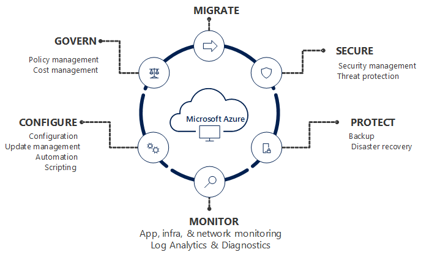
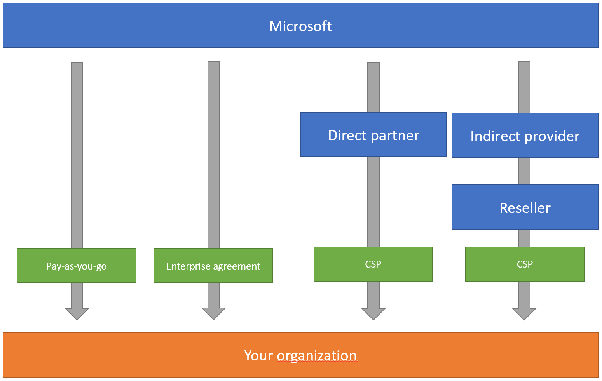

**What is Azure?**

Microsoft Azure is an ever-expanding set of cloud services to help your organization meet your business challenges. It’s the freedom to build, manage, and deploy applications on a massive, global network using your favorite tools and frameworks.
Azure is Microsoft's cloud solution. A cloud is essentially a collection of host data centers that you don't have to directly manage. You can request services from that cloud Cost, Global scale, performance, security, speed, productivity, Reliability.
Azure is Responsible for

*Azure is Responsible for*

Availability of the platform (datacenter, connectivity, server, power cooling) Data availability Maintenance of the platform (datacenter, connectivity, server storage) Physical security Availability of the service (VM, storage, Network)

*Azure is NOT responsible*

for VM OS, Application deployment on the VM, Resource security Customer are responsible for VM maintenance & VM OS maintenance Application availability Backup and recovery &Configure the monitoring User’s security, Configure the AD or other services

**Governance :-**

* Governance in Azure is one aspect of Azure Management.
* Governance provides mechanisms and processes to maintain control over your applications and resources in Azure. 
* It involves planning your initiatives and setting strategic priorities. Governance in Azure is primarily implemented with two   services. Azure Policy allows you to create, assign, and manage policy definitions to enforce rules for your resources. This feature keeps those resources in compliance with your corporate standards. 
* Azure Cost Management allows you to track cloud usage and expenditures for your Azure resources and other cloud providers.

**What is Azure Subscription?**

* A subscription is a logical unit of Azure services that is linked to an Azure account. Each associated account has a role in a subscription. Billing for Azure services is done on a per-subscription basis.
* A Microsoft Azure subscription grants you access to Azure services and to the Microsoft Azure Platform Management Portal.
* Azure subscription is billing container for deployed Microsoft Azure Services
* We can deploy our IaaS, PaaS, SaaS application (web apps VM storage account network DR etc.)
* Azure Subscription has trusted relationship with Azure AD
* All the users, service, and devices authentication from Azure AD

**What is a Microsoft Enterprise Agreement?**
Microsoft Enterprise Agreement (EA) is a software volume licensing agreement designed for large organisations. It facilitates licensing Microsoft products and services across Microsoft's entire catalogue.

It aims to simplify software license management and budget allocation, although the benefits may vary depending on your organisation's specific circumstances.

Microsoft Enterprise Agreement (EA) is the most popular way to procure licenses and cloud services for organisations with over 500 users or devices:

*  Provides access to a wide range of Microsoft products and services.
* Includes cloud services like Azure and Office 365.
* Allows spread payment over a three-year period.
* Has price protection.
* Offers significant discounts compared to standard licensing costs.
* Requires an upfront commitment to Microsoft software and services.
* Provides Software Assurance benefits including upgrades and support.

**What is an Azure account?**

**Account Administrator**
An Azure account administrator is the person who creates an Azure account and is responsible for all subscriptions and resources in that account. They are also the default Service Administrator for the subscription. 

**Service Administrator**
Responsible for creating and managing resources in a subscription, but not for billing. The account administrator can assign a separate user to this role. 

**Co-administrator**
Can have the same access privileges as the Service Administrator, but cannot change the Service Administrator. Multiple co-administrators can be assigned to a subscription. 

**Global administrator**
Has the highest level of access, including the ability to grant administrator access to other users and reset their passwords. 

**User administrator**
Can create and manage users and groups, and reset passwords for users, Helpdesk administrators, and other User administrators. 

**Groups administrator**
Can create, edit, delete, and restore groups, and manage Office 365 Groups policies. 

**Contributor**
Can create and manage all types of Azure resources, but cannot grant access to others. 

**Reader**
Can view existing Azure resources